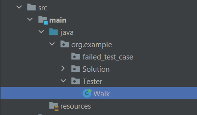
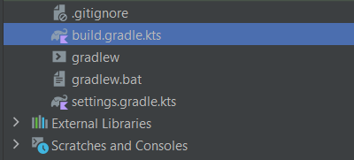
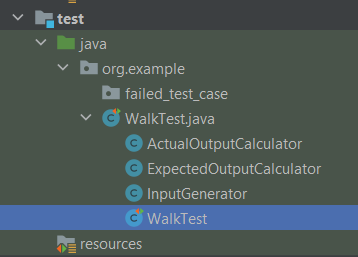
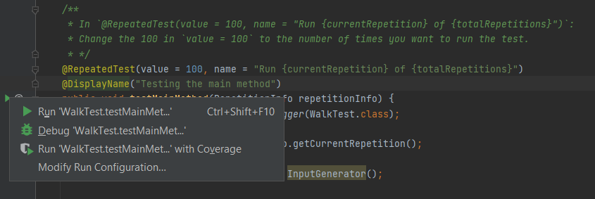
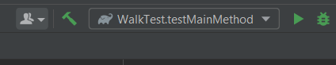
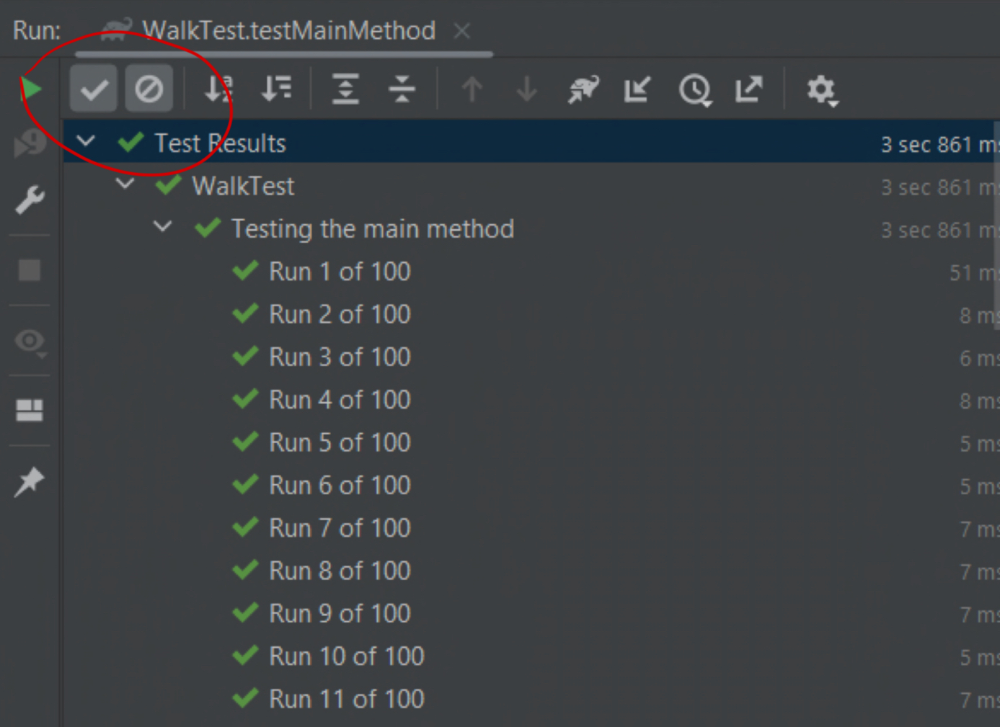
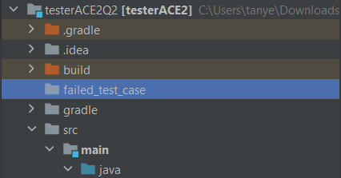
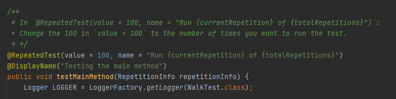
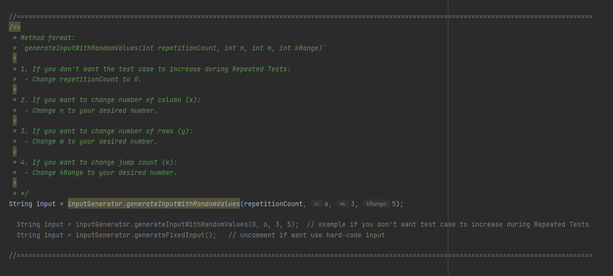

# ACE-CW2-Tester
## How to use Tester
### How to add your `java.file` to test
1. Paste your `Walk.java` or `Maze.java` into the `Tester` folder.

### How to run the tester
1. You may need to build the gradle first.

2. First go to the `WalkTest` class in `WalkTest.java`.

3. Next press the green arrow.

4. Press the first one `Run 'WalkTest.testMainMet...'` and the tester should work. 

5. After the first next, you can just run it normally.

## How to view pass test and fail test
- Press the arrow to show the passed test only
- Press the blocked button to show failed test only
- Press both to show both passed and failed test

## How to view failed test case report
The failed test case will be generated in the `failed_test_case` folder.

## How to customize test case
### How to set the number of times to run the test case
1. First go to the `WalkTest` class in `WalkTest.java`.

2. Then follow the javadoc instruction (in green).

### How to change the size of the test case
1. First go to the `WalkTest` class in `WalkTest.java`.

2. Change the value according to the javafoc instruction (in green).

